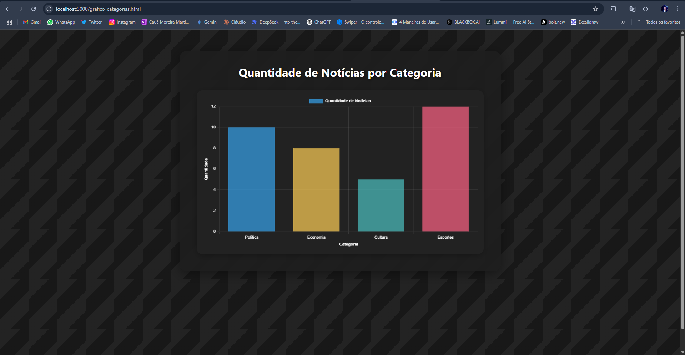
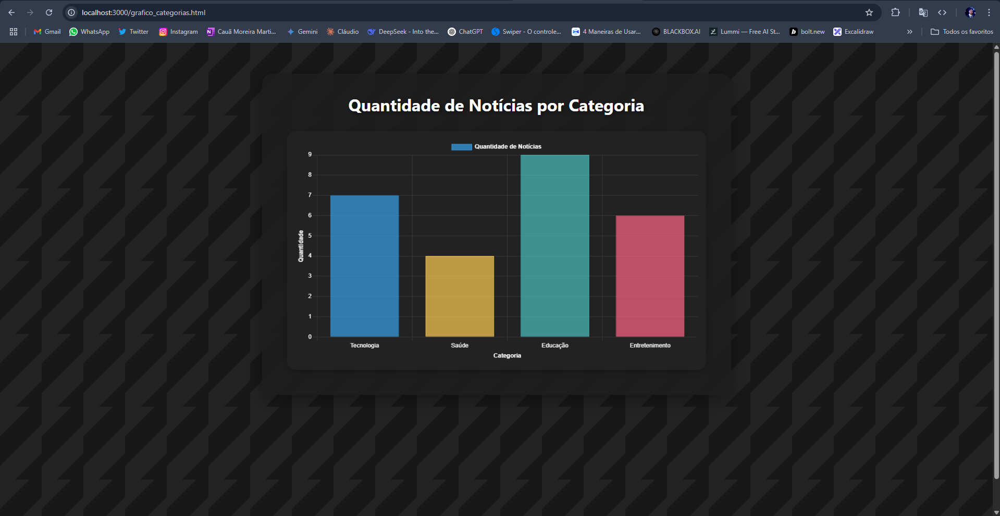

Aluno: Cauã Moreira Martins
Matrícula: 00878733-

Nesta etapa, foi criada uma nova página HTML com o objetivo de apresentar dinamicamente os dados do portal de notícias através de um gráfico de barras. Para isso, utilizamos a biblioteca Chart.js, que foi importada via CDN.

O gráfico exibe a quantidade de notícias por categoria, como política, economia, cultura e esportes. Os dados foram organizados em um array JSON simulado e processados com JavaScript, permitindo a geração automática do gráfico conforme os dados disponíveis.

A estrutura do código foi dividida em:

Um elemento <canvas> para renderizar o gráfico.

Um script que carrega os dados JSON.

A configuração do Chart.js para montar o gráfico de barras.

A implementação também permite facilmente a substituição dos dados para testes com diferentes cenários, o que possibilitou a criação de dois prints distintos da funcionalidade, como solicitado na atividade.

